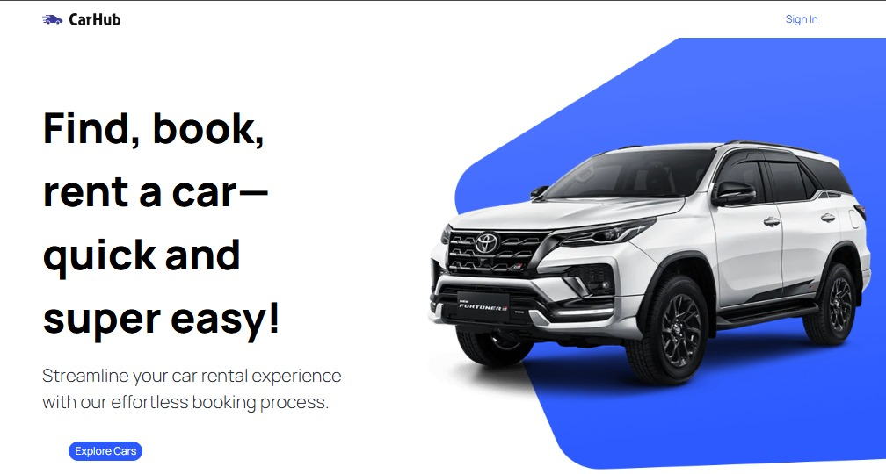

    <a href="https://zoom-app-puce.vercel.app/">
    
    <a>

&nbsp;&nbsp;&nbsp;
  
  NEXT.js

---

### CarRental Pro - Quick & Easy Car Booking Platform
CarRental Pro revolutionizes the car rental experience with a seamless, efficient, and user-friendly platform that puts the power of choice directly in your hands. Find, book, and rent your perfect vehicle in just a few clicks!

---

### <a name="tech-stack">⚙️ Tech Stack</a>

- Next.js
- TypeScript
- Tailwind CSS
